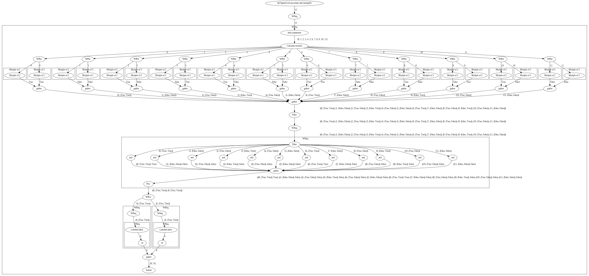

# Croworkflow

Croworkflow helps you combine tasks into workflows.
Croworkflow focuses on ease of composition and observability, and views performance as an acceptable price to pay for this.

## Current features

### Fun API

Croworkflow tasks are just wrapped callables:
```
from ops import Proc

halve = Proc(lambda x: x/2, "halve")
```

Croworkflow makes it easy to combine tasks
- sequentially: `task0 >> task1`
- parallel: `task0 // task1`

### Cool visualisations

Croworkflow will graph all the tasks executed.
Just look at this amazing way of finding multiples of 6:

```python
from ops import Proc, Const, WfFor, Filter, NOOP
from interpreter import Interpreter

def multiple_of(k: int):
    return Proc(lambda x: x % k == 0, f"Mutiple of {k}")

do_things = (
    Proc(lambda x: list(range(0, x)), "fetch parameters")
    >> WfFor(NOOP() // (multiple_of(2) // multiple_of(3)))
    >> Filter(Proc(lambda x: x[1][0] and x[1][1]))
    >> WfFor(Proc(lambda x: x[0]))
    >> WfFor(Proc(str), "str")
    >> Proc(lambda l: ", ".join(l))
)

if __name__ == "__main__":
    print(Interpreter().begin_interpret(do_things, 12))
```



## Future features

- More ergonomic workflow types
- Error handling
- Turn off Cool Visualisations
- Logging
- A scheduler for easy parallelisation
